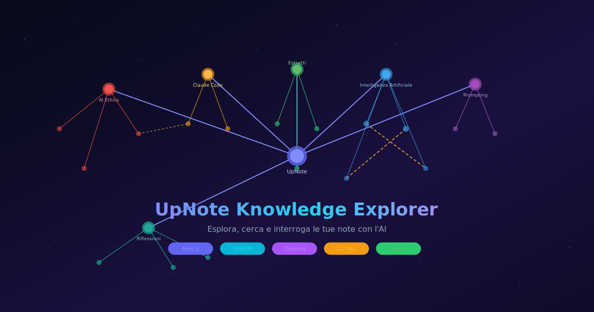

# UpNote Knowledge Explorer



Un'applicazione web per esplorare, cercare e interrogare le proprie note UpNote con l'aiuto dell'intelligenza artificiale.

## Funzionalità

| Feature | Descrizione |
|---------|-------------|
| **Grafo interattivo** | Visualizza le note come nodi colorati per categoria, con collegamenti cross-topic evidenziati. Clicca un nodo per vedere l'anteprima. |
| **Ricerca full-text** | Motore di ricerca fuzzy (fuse.js) su titolo, contenuto e collegamenti delle note. |
| **RAG con AI** | Fai domande in linguaggio naturale e ottieni risposte generate da un LLM, con le fonti citate e cliccabili. |
| **Temi** | Dark mode futuristico con effetti spaziali (default) e light mode. |
| **Sidebar categorie** | Filtra il grafo per categoria (AI Ethics, Claude Code, Estratti, ecc.). |

## Stack

- **Next.js 16** (App Router, React 19)
- **ShadCN UI** + **Tailwind CSS v4**
- **vis-network** — grafo interattivo
- **fuse.js** — ricerca fuzzy
- **Vercel AI SDK** — integrazione LLM con streaming
- **OpenRouter** / **Ollama** / **OpenAI** — provider LLM

## Installazione

```bash
# Clona il repo
git clone https://github.com/tuo-username/upnote-explorer.git
cd upnote-explorer

# Installa dipendenze
npm install

# Pre-processa le note (genera data/notes.json)
npx tsx scripts/build-notes.ts

# Avvia il dev server
npm run dev
```

Apri [http://localhost:3000](http://localhost:3000).

## Configurazione

Copia `.env.example` in `.env.local` e configura il provider LLM:

### OpenRouter (consigliato, modelli gratuiti)

```env
LLM_PROVIDER=openrouter
OPENROUTER_API_KEY=sk-or-v1-...
OPENROUTER_MODEL=nvidia/nemotron-3-super-120b-a12b:free
```

### Ollama (locale)

```env
LLM_PROVIDER=ollama
OLLAMA_BASE_URL=http://localhost:11434
OLLAMA_MODEL=llama3.2
```

### OpenAI

```env
LLM_PROVIDER=openai
OPENAI_API_KEY=sk-...
OPENAI_MODEL=gpt-4o-mini
```

## Come aggiungere le tue note

1. Esporta le note da UpNote (cartella con file `.md`)
2. Modifica `scripts/build-notes.ts` puntando `NOTES_DIR` alla tua cartella
3. Esegui `npx tsx scripts/build-notes.ts`
4. Le note vengono indicizzate in `data/notes.json`

## Struttura

```
upnote-explorer/
├── app/
│   ├── layout.tsx            # Root layout + theming
│   ├── page.tsx              # Pagina principale
│   └── api/
│       ├── search/route.ts   # Ricerca fuse.js
│       └── ask/route.ts      # RAG con LLM
├── components/
│   ├── note-graph.tsx        # Grafo vis.js
│   ├── search-bar.tsx        # Barra di ricerca
│   ├── search-results.tsx    # Risultati testuali
│   ├── rag-answer.tsx        # Risposta AI + fonti
│   ├── sidebar-nav.tsx       # Sidebar categorie
│   ├── note-sheet.tsx        # Anteprima nota
│   ├── space-background.tsx  # Sfondo animato
│   └── theme-toggle.tsx      # Toggle dark/light
├── lib/
│   ├── types.ts              # Tipi TypeScript
│   ├── notes-loader.ts       # Caricamento note
│   └── search-engine.ts      # Fuse.js config
├── scripts/
│   └── build-notes.ts        # Pre-processing .md → JSON
└── data/
    └── notes.json            # Note indicizzate (generato)
```

## Licenza

MIT
