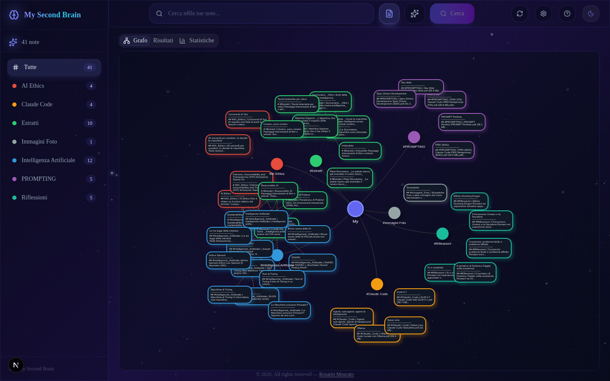
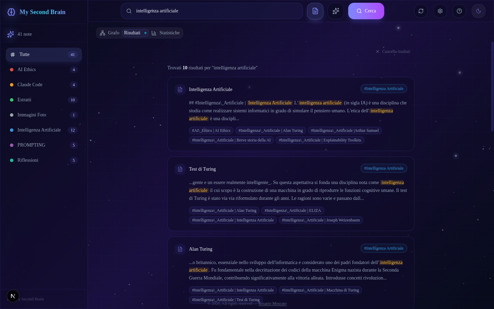
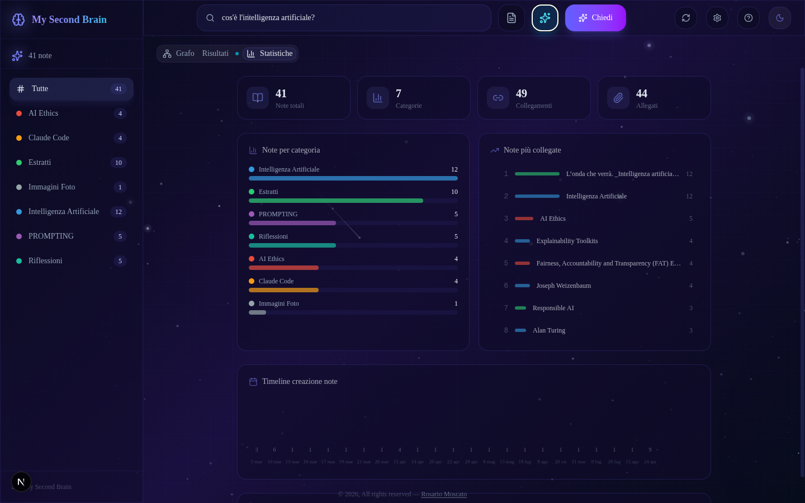
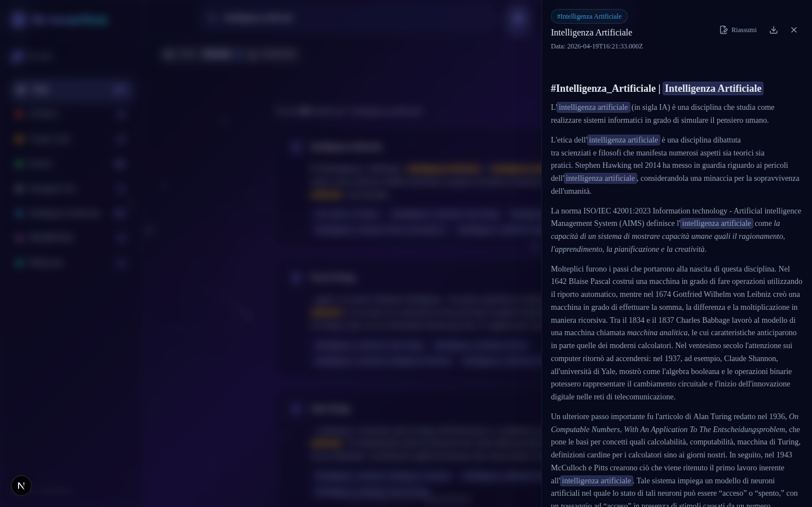
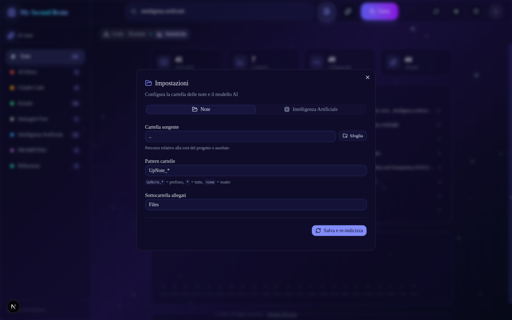
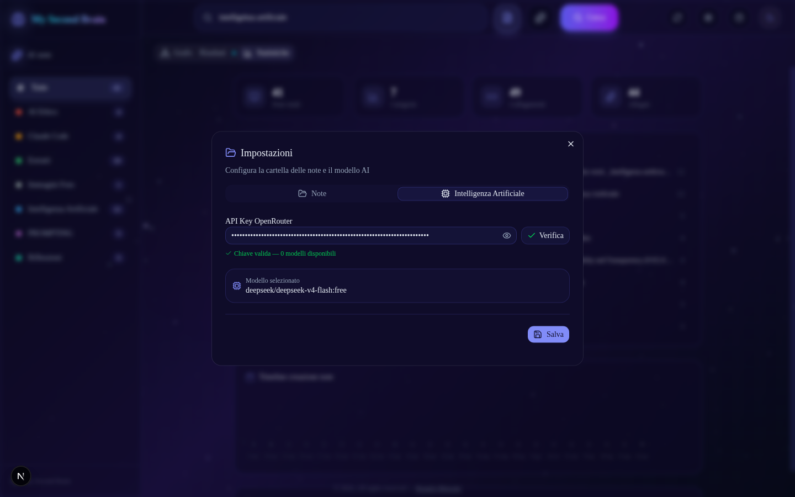
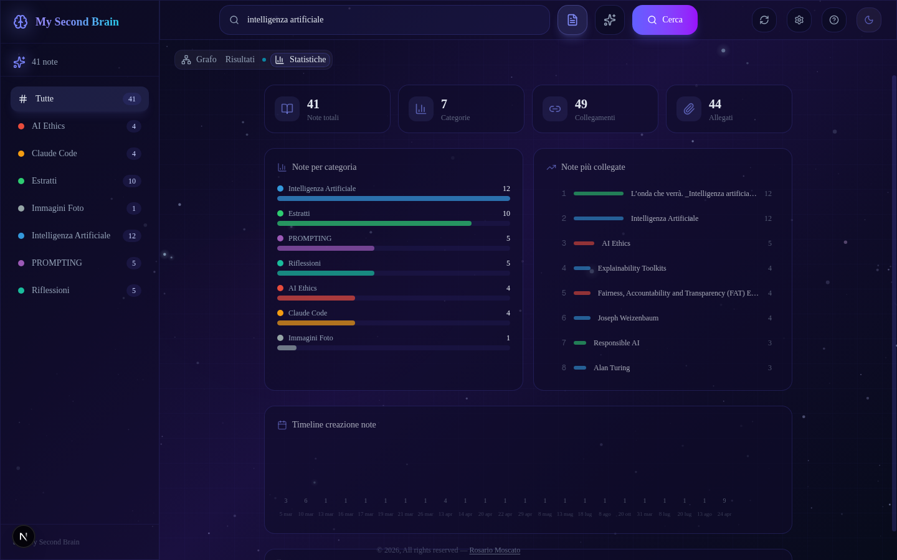

# My Second Brain — Guida Utente

Esplora, cerca e interroga le tue note markdown con l'aiuto dell'intelligenza artificiale. Grafo interattivo, ricerca full-text e Q&A AI con citazioni delle fonti.

---

## Indice

- [Primo avvio](#primo-avvio)
- [L'interfaccia](#linterrfaccia)
- [Grafo interattivo](#grafo-interattivo)
- [Ricerca](#ricerca)
- [Domande all'AI (RAG)](#domande-allai-rag)
- [Visualizzare una nota](#visualizzare-una-nota)
- [Impostazioni](#impostazioni)
- [Keyboard shortcuts](#keyboard-shortcuts)
- [Statistiche](#statistiche)
- [Installazione (sviluppatori)](#installazione-sviluppatori)
- [Configurazione avanzata](#configurazione-avanzata)

---

## Primo avvio

### Configurazione rapida

1. Avvia l'app con `npm run dev` e apri [http://localhost:3000](http://localhost:3000)
2. Clicca l'icona ⚙️ **Impostazioni** nell'header in alto a destra
3. **Tab "Note"**: se necessario, cambia la cartella sorgente e il pattern delle sottocartelle, poi clicca "Salva e re-indicizza"
4. **Tab "Intelligenza Artificiale"**: inserisci la tua **API Key OpenRouter**, clicca "Verifica", seleziona un modello dalla lista, poi "Salva"

Tutto qui. Le impostazioni vengono salvate e ricordate tra una sessione e l'altra.

### API Key OpenRouter

Per usare le funzioni AI serve una chiave OpenRouter:

1. Registrati su [openrouter.ai](https://openrouter.ai)
2. Vai su **Keys** e crea una nuova API key
3. Incolla la chiave nelle Impostazioni → tab "Intelligenza Artificiale"
4. Clicca **Verifica** per confermare che funzioni
5. Scegli un modello dalla lista (i modelli **Free** sono in cima) e clicca **Salva**

---

## L'interfaccia

L'interfaccia è composta da:

| Elemento | Posizione | Descrizione |
|----------|-----------|-------------|
| **Sidebar** | Sinistra | Lista categorie con conteggio note. Clicca una categoria per filtrare. |
| **Barra di ricerca** | Centro alto | Cerca tra le note o fai domande all'AI. |
| **Tab Grafo** | Area principale | Visualizzazione grafo delle note. |
| **Tab Risultati** | Area principale | Risultati di ricerca o risposta AI. |
| **Tab Statistiche** | Area principale | Dashboard con metriche sulle note. |
| **Header** | In alto | Ricerca, aggiornamento note, impostazioni, tema. |

### Header (da sinistra a destra)

- **Barra di ricerca** — digita per cercare o chiedere all'AI
- **⟳ Aggiorna note** — re-indicizza le note dalla cartella sorgente
- **⚙️ Impostazioni** — configura cartella note e modello AI
- **TemA chiaro/scuro** — cambia tema
- **📖 Guida** — apre questa documentazione

---

## Grafo interattivo



Il **tab Grafo** mostra tutte le note come nodi collegati. Ogni nodo è una mini-card con:
- **Titolo** della nota
- **Anteprima** del contenuto (primi 80 caratteri)
- **Bordo colorato** per categoria

### Interazioni

- **Clicca** un nodo per aprire la nota nel pannello laterale
- **Passa il mouse** su un nodo per vedere un tooltip con titolo, categoria e abstract
- **Trascina** i nodi per riorganizzare il grafo
- **Scroll** per zoom in/out
- **Clicca una categoria** nella sidebar per filtrare e mostrare solo le note di quella categoria

### Filtrare per categoria

Clicca un elemento nella **sidebar sinistra** per filtrare il grafo, i risultati di ricerca e le risposte AI. Un chip colorato appare sotto i tab per indicare il filtro attivo. Clicca la **X** sul chip per rimuovere il filtro.

---

## Ricerca



La barra di ricerca supporta due modalità:

### Modalità Testo 🔍

Ricerca full-text fuzzy su titolo, contenuto e collegamenti delle note. I risultati mostrano:
- Titolo della nota con categoria
- Snippet con il contesto del match evidenziato
- Score di rilevanza

### Modalità AI 🤖

Fai una domanda in linguaggio naturale. L'AI risponde basandosi esclusivamente sulle tue note, citando le fonti. Vedi la sezione [Domande all'AI](#domande-allai-rag) per i dettagli.

### Cambiare modalità

- Clicca il toggle **🔍 Testo / 🤖 AI** nella barra di ricerca
- Oppure premi **Tab** mentre la barra di ricerca è attiva

### Cronologia ricerche

Quando clicchi la barra di ricerca, appare un dropdown con le **ultime 20 ricerche**. Inizia a digitare per filtrare la cronologia. Clicca una voce per rilanciarla, o la **X** per rimuoverla.

---

## Domande all'AI (RAG)



La modalità AI permette di fare domande in linguaggio naturale sulle tue note. L'AI risponde in italiano, citando le fonti.

### Come funziona

1. Scrivi la domanda nella barra di ricerca (modalità AI)
2. L'AI cerca le note più rilevanti alla tua domanda
3. Genera una risposta basata **solo** sulle tue note
4. Ogni affermazione cita la nota fonte tra asterischi (es. *Breve storia della AI*)
5. Le fonti citate appaiono come schede espandibili sotto la risposta

### Chat multi-turno

Puoi fare **domande di follow-up**: l'AI mantiene il contesto della conversazione. Usa il campo di input in basso per continuare la conversazione.

- **Nuova chat** — cancella il contesto e ricomincia
- **Esporta conversazione** — scarica la chat come file Markdown

### Sorgenti espandibili

Sotto ogni risposta AI trovi le **fonti citate**. Clicca una fonte per espanderla e vedere:
- **Categoria** (badge colorato)
- **Snippet** del contenuto (300 caratteri)
- **Leggi tutto** — apre la nota completa nel pannello laterale
- **Apri nel grafo** — passa al tab Grafo, zooma e seleziona il nodo corrispondente

### Riassunto nota

Quando visualizzi una nota, trovi il pulsante **"Riassumi"** nell'header del pannello. L'AI genera un riassunto conciso (5-6 righe) della nota, mostrato in una card dedicata con streaming in tempo reale.

---

## Visualizzare una nota



Clicca una nota dal grafo, dai risultati di ricerca, o da una fonte AI per aprirla nel **pannello laterale** (NoteSheet).

### Contenuto del pannello

- **Header** con titolo, categoria (badge colorato) e pulsanti azione
- **Contenuto** renderizzato in markdown reale (titoli, liste, link, codice, tabelle)
- **Allegati** — immagini e file collegati alla nota
- **Collegamenti** — link ad altre note (cliccabili)
- **Note correlate** — suggerimenti automatici di note simili
- **Breadcrumb** — trail di navigazione quando segui collegamenti tra note

### Azioni disponibili

| Pulsante | Descrizione |
|----------|-------------|
| **Riassumi** | Genera un riassunto AI della nota |
| **Download ▾** | Esporta la nota come **Markdown** (.md) o **PDF** |

### Evidenziazione ricerca

Se arrivi a una nota dai risultati di ricerca, i termini cercati vengono **evidenziati** nel contenuto con sfondo indigo.

### Note correlate

La sezione "Note correlate" suggerisce automaticamente note simili basandosi su:
- Backlink (altre note che linkano a questa) — peso 3
- Forward link (questa nota linka ad altre) — peso 3
- Link condivisi (entrambe linkano alla stessa nota) — peso 2
- Stessa categoria — peso 1

---

## Impostazioni

Clicca l'icona ⚙️ nell'header per aprire il dialog delle impostazioni, diviso in due tab.

### Tab "Note"



| Campo | Descrizione | Esempio |
|-------|-------------|---------|
| **Cartella sorgente** | Percorso della cartella che contiene le sottocartelle con le note | `..`, `/home/user/note` |
| **Pattern cartelle** | Filtro sui nomi delle sottocartelle | `UpNote_*`, `*`, `appunti` |
| **Sottocartella allegati** | Nome della sottocartella dentro ogni cartella note che contiene gli allegati | `Files` |

**Sfoglia cartelle**: clicca il pulsante "Sfoglia" per navigare le sottocartelle del progetto e selezionare la cartella sorgente in modo visuale.

**Pattern**:
- `UpNote_*` — tutte le cartelle che iniziano per "UpNote_"
- `*` — tutte le sottocartelle
- `nome_esatto` — solo la cartella con quel nome esatto

Dopo aver modificato le impostazioni, clicca **"Salva e re-indicizza"** per applicare i cambiamenti e ricaricare le note.

### Tab "Intelligenza Artificiale"



| Campo | Descrizione |
|-------|-------------|
| **API Key OpenRouter** | La chiave API per accedere ai modelli LLM su OpenRouter |
| **Modello** | Il modello LLM da utilizzare per risposte AI e riassunti |

**Flusso di configurazione**:
1. Incolla la tua **API Key** nel campo
2. Clicca **Verifica** — il sistema contatta OpenRouter e verifica la chiave
3. Se la chiave è valida, appare la **lista dei modelli disponibili** (i gratuiti sono in cima)
4. Cerca un modello per nome o scorri la lista
5. Clicca un modello per selezionarlo
6. Clicca **Salva**

I modelli sono etichettati con badge **Free** (verde) o **Paid** (arancione). Per ogni modello è indicata la lunghezza del contesto (es. 128k).

### Persistenza

Le impostazioni vengono salvate nel file `data/settings.json`. Alla prima installazione tutti i campi sono vuoti — compila le impostazioni dall'interfaccia e saranno ricordate.

Se esiste un file `.env.local` con variabili configurate (es. `OPENROUTER_API_KEY`), queste vengono usate come fallback quando le impostazioni UI non sono ancora state configurate.

---

## Keyboard shortcuts

| Tasto | Azione |
|-------|--------|
| `/` | Focus sulla barra di ricerca |
| `Tab` | Nella barra di ricerca: cambia modalità (Testo ↔ AI) |
| `Esc` | Chiude il pannello nota |
| `↑` `↓` | Naviga tra i risultati di ricerca |
| `Enter` | Apri la nota selezionata nei risultati |

---

## Statistiche



Il **tab Statistiche** mostra una dashboard con:

- **Schede riassuntive**: numero totale note, categorie, collegamenti, allegati
- **Grafico a barre**: distribuzione note per categoria
- **Top 8 note più collegate**: le note con più link in entrata/uscita (cliccabili)
- **Timeline**: distribuzione delle note nel tempo
- **Informazioni contenuto**: lunghezza media delle note

---

## Installazione (sviluppatori)

```bash
git clone https://github.com/rosariomoscato/UpNote_Explorer.git
cd UpNote_Explorer/upnote-explorer
npm install
npm run dev
```

Apri [http://localhost:3000](http://localhost:3000). Il comando `npm run dev` esegue prima il build delle note poi avvia il dev server.

## Stack tecnico

- **Next.js 16** (App Router, React 19)
- **ShadCN UI** + **Tailwind CSS v4**
- **vis-network** — grafo interattivo
- **fuse.js** — ricerca fuzzy
- **Vercel AI SDK** — integrazione LLM con streaming
- **framer-motion** — animazioni
- **marked** — rendering markdown
- **OpenRouter** / **Ollama** / **OpenAI** — provider LLM

## Configurazione avanzata

### Variabili d'ambiente (`.env.local`)

Le variabili d'ambiente sono il **fallback** quando le impostazioni UI non sono configurate:

```env
NEXT_PUBLIC_APP_NAME=My Second Brain
LLM_PROVIDER=openrouter
OPENROUTER_API_KEY=sk-or-v1-...
OPENROUTER_MODEL=deepseek/deepseek-chat-v3-0324:free
```

### File di configurazione

| File | Scopo | Modificabile da UI |
|------|-------|--------------------|
| `notes.config.json` | Configurazione build note (source, pattern) | Sì (tab Note → Salva) |
| `data/settings.json` | Impostazioni utente (note + AI) | Sì (entrambi i tab) |
| `.env.local` | Variabili d'ambiente (fallback) | No, manuale |

### Provider LLM alternativi

Oltre a OpenRouter (configurabile da UI), puoi usare altri provider via `.env.local`:

**Ollama (locale):**
```env
LLM_PROVIDER=ollama
OLLAMA_BASE_URL=http://localhost:11434
OLLAMA_MODEL=llama3.2
```

**OpenAI:**
```env
LLM_PROVIDER=openai
OPENAI_API_KEY=sk-...
OPENAI_MODEL=gpt-4o-mini
```

### Struttura progetto

```
upnote-explorer/
├── app/
│   ├── page.tsx               ← Pagina principale
│   ├── layout.tsx             ← Root layout + theming
│   └── api/
│       ├── ask/route.ts       ← RAG endpoint
│       ├── search/route.ts    ← Ricerca fuse.js
│       ├── summarize/route.ts ← Riassunto AI
│       ├── rebuild/route.ts   ← Re-index
│       └── settings/          ← API impostazioni
├── components/
│   ├── settings-dialog.tsx    ← Dialog impostazioni
│   ├── note-graph.tsx         ← Grafo vis-network
│   ├── note-sheet.tsx         ← Pannello nota
│   ├── search-bar.tsx         ← Barra di ricerca
│   ├── rag-answer.tsx         ← Chat AI + fonti
│   └── ...                    ← Altri componenti UI
├── lib/
│   ├── settings.ts            ← Gestione impostazioni
│   ├── notes-loader.ts        ← Caricamento note
│   └── search-engine.ts       ← Motore di ricerca
├── scripts/
│   └── build-notes.ts         ← Build note markdown → JSON
└── data/
    ├── notes.json             ← Note indicizzate (generato)
    └── settings.json          ← Impostazioni utente (generato)
```

---

## Licenza

MIT — © 2026 [Rosario Moscato](https://rosmoscato.xyz)
